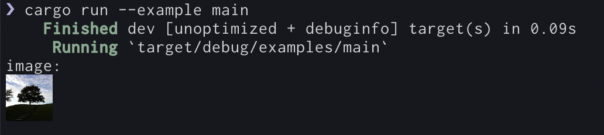

# iterm2img

Rust library for iTerm2 [Inline Images Protocol](https://iterm2.com/documentation-images.html)

## Usage

```rust
let encoded = iterm2img::from_bytes(bytes)
    .width(5)
    .inline(true)
    .build();

println("{}", encoded);
```

See [examples/main.rs](./examples/main.rs) for full code.

Running this on iTerm2 gives the following:



## License

MIT
